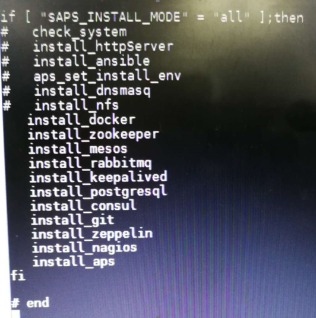

#  安装APS

## 安装说明
APS的安装包括基础组件以及APS私有组件的安装。在安装过程中，只需要将APS安装包上传到APS集群的主节点，修改安装配置后执行安装脚本即可。安装脚本会根据配置将相关组件的安装程序包分发到对应的节点并完成各组件的安装和配置。

## 安装前提

在安装前，请确保APS中的主机满足如下条件：

1. 已完成各主机的基础环境配置，具体配置步骤请参考“配置基础环境”章节。

2. 已获取APS安装包。

## Repo配置

### 安装说明

只需要在APS集群的主节点APS01上安装Repo仓库即可。

安装Repo仓库使用的安装包列表如下所示：

* R镜像源：CRAN.tar.gz
* Python镜像源：pypi.tar.gz 

### 安装过程
```
mkdir -p /data/repo/
sudo mkfs -t ext4 [repo磁盘]  #[repo磁盘]格式化为ext4格式
mount [repo磁盘] /data/repo/
tar zxvf CRAN.tar.gz  -d /data/repo/
tar zxvf pypi.tar.gz  -d  /data/repo/
```

## Nfs配置

### 安装说明

只需要在APS集群的主节点APS03上安装配置nfs磁盘。

### 安装APS软件包
```
mkdir -p /mnt/data
sudo mkfs -t ext4 [nfs磁盘]   #[nfs磁盘]格式化为ext4格式
mount [nfs磁盘] /mnt/data 
添加开机自动挂载磁盘
vi /etc/fatab
[nfs磁盘]  /mnt/data  ext4   defaults   0   0
```
## 安装过程

1. 以aps用户登录APS集群主节点。

2. 上传APS安装包。
  
  将安装包aps-deploy-*.tgz上传到APS集群主节点aps用户的家目录“/home/aps”下。

3. 解压安装包。
  ```
  #su – aps
  $ cd
  $ tar -zxvf aps-deploy-*.tgz
  ```

4. 修改配置文件“/home/aps/aps-deploy/conf/hosts”。

 该配置文件用于配置各组件安装服务器的IP地址，需要根据实际组网进行配置，配置样例如下所示： 
 
     ```
     # aps hosts
     [allips]
     aps01_ip
     aps02_ip
     aps03_ip
     aps04_ip
     [dnsmasq-master]
     aps01_ip
     [dnsmasq-backup]
     aps02_ip
     [nfs-server]
     aps03_ip
     [nfs-client]
     aps01_ip
     aps02_ip
     [docker-registry]
    aps01_ip  docker_disk_file=/dev/sda    #指定docker存储盘
    [docker-service]
    aps02_ip  docker_disk_file=/dev/sda     #指定docker存储盘
    aps03_ip  docker_disk_file=/dev/sda     #指定docker存储盘
    aps04_ip docker_disk_file=/dev/vdb      #指定docker存储盘
    [zookeeper]
    aps01_ip
    aps02_ip
    aps03_ip
    [mesos-master]
    aps01_ip
    aps02_ip
    aps03_ip
    [mesos-slave]
    aps01_ip
    aps02_ip
    aps03_ip
    [mesos-marathon]
    aps04_ip
    [rabbitmq-master]
    aps02_ip
    [rabbitmq-slave]
    aps03_ip
    [keepalived-master]
    aps02_ip vrrp_interface: eth0 [keepalived-backup]
    [postgresql-master]
    aps02_ip
    [postgresql-slave]
    aps03_ip
    [consul-master]
    aps01_ip
    aps02_ip
    aps03_ip
    [consul-slave]
    aps04_ip
    [git-master]
    aps01_ip
    [git-backup]
    aps02_ip
    [aps-push]
    aps01_ip
    [aps-pull]
    aps01_ip
    aps02_ip
    aps03_ip
    aps04_ip
    [zeppelin]
     aps02_ip
    aps03_ip
    [apollo]
    aps02_ip
    [nagios-server]
    aps01_ip
    [nagios-client]
    aps01_ip
    aps02_ip
    aps03_ip
    aps04_ip
   
    ```

5. 修改配置文件“/home/aps/aps-deploy/conf/aps.yml”。

   该配置文件用于配置相关组件的工作目录、IP地址等运行环境信息，其中大部分参数保留默认值即可，只需要关注并修改如下参数（参考示例，仅用于测试环境）：
 
 * 配置docker存储所需磁盘（每个节点磁盘规划统一的情况下配置）
  
    ```
    docker_disk_file: [docker磁盘]   #配置每个节点统一提供的docker存储盘
    示例：
    docker_disk_file: /dev/sdc
    ```
   
   * 配置NFS
   
    ```
    nfs_share_dir: /mnt/nfsdata
    nfs_share_subnet: 当前网段的子网掩码/24
    ```
   
   * 配置Zookeeper集群参数，默认即可

     ```
     zookeeper_quorum: 1
     ```

  * 配置keepalived网卡名称及VIP地址（需要ifconfig查看网卡信息进行配置）
    ```
    # keepalived
    vrrp_interface: ens192
    postgresql_vip: postgresql的虚拟ip（向网管理申请）
    ```
  * 配置krb5信息
    ```
    # krb5
    krb5_default_realm: TEST.COM (向AD管理员申请)
    kdcserver: AD ip   (向AD管理员申请)
    krb5_domain_realm: ['.zetyun.com','zetyun.com']
    ```

  * 配置zeppelin相关的AD
    ```
    # zeppelin
    shiro_searchBase: 'OU=f,DC=TEST,DC=COM'
    shiro_groupRolesMap: '"CN=apsadmin,OU=f_inc2,DC=TEST,DC=COM":"admin"'
    ```
  * 配置Mesos资源分配（建议按1:3比例分配）
     ```
    # mesos
    mesos_resources:
       'cpus(heron):2;cpus(controller):6;mem(heron):8000;mem(controller):24000;disk(heron):366843;disk(controller):550264'
    ```

    * 配置dasserver配置项（该项内容向CDH管理员申请）
    ```
    hdfs_host: hdfs访问ip
    livy_host: livy访问ip
    das_ad_user: zetyun@TEST.com
    das_ad_pass: 123456
    ```
    * 配置CDH hosts
   
      将cdh hosts地址按照示例模板格式进行填写，集群信息由CDH管理员提供
      ```
      cdh_cluster:
    - {ip: 'cdh节点1IP' , domain: 'cdh1.test.com' , hostname: 'cdh1'}
    - {ip: 'cdh节点2IP ' , domain: 'cdh2.test.com' , hostname: 'cdh2'}
      ```	
    * 执行安装脚本。
    ```
     vim /home/aps/aps-deploy/bin/aps.sh
     $ cd /home/aps/aps-deploy/bin
     $ ./aps.sh -m all
    ```
    该脚本会完成系统检查以及各基础组件的安装。

        
   备注：
    
    1. 如果安装失败继续执行，需要删除/tmp下的安装日志/tmp/aps_installation_failure_exit_code，并把aps.sh脚本里的最后边，注释掉已经安装成功的组件，如下图所示：
    
    
     
    2. 如果在install Docker-CE这一步出错的话：执行步骤为:

        到除节点一之外的节点上，分别执行脚本/usr/local/aps/tmp/devicemapper.sh，然后在节点一注释掉如上图部分内容，之后继续执行./aps.sh -m all;

    3. 以上aps.sh执行成功后，aps用户在节点一上执行jps查看Controller,Scheduler,HeronServer,das,mpserver.jar,UserCenter,SpecsServer,FalconServer是否启动，使用docker ps 查看pipes,compass 是否启动。使用root用户在节点二上执行jps查看keytabserver是否启动成功。(执行jps，如果显示command not found。执行source /etc/profile。再次执行jps验证。)


